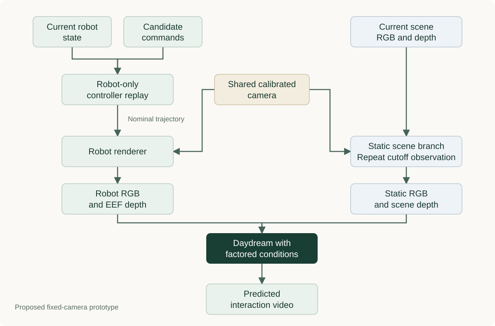

# RoFacto in Daydream: implementation comparison and PRD

**Recommendation:** add a separate robot-factored conditioning mode to Daydream. Reuse its video model, data handling, training infrastructure, and evaluation tools. Build the nominal robot rollout, separated render streams, and forecasting provenance contract explicitly. Keep ReImagine as an appearance baseline or later augmentation experiment.

September 10, 2026 · Proposed design, not an implemented feature.

[Reading edition](PRD%20-%20Robot-Factored%20Daydream.html) · [RoFacto Q&A](RoFacto%20-%20Questions%20and%20Research.md)

This document compares [MoonlakeAI/reimagine-daydream at `fec1567`][repo] with [RoFacto v1][paper]. The repository snapshot was retrieved through authenticated GitHub access at the exact commit `fec156723613b3b1aeecaa474650c3a835b12847`, dated September 4, 2026. Source links below are pinned to that commit. **This document contains analysis of a private repository and is saved locally; it has not been published to the public ResearchNotes repository.**

The review followed the maintained model, dataset, trainer, sampler, ReImagine pipeline, and relevant archived replay code. It did not download model weights or datasets, run GPU inference, or reproduce reported quality. “Implemented” below means a code path exists. It does not mean that path is deployed or validated at a particular performance level. RoFacto's official repository still says [“Code coming soon”][rofacto-code]; a faithful implementation would currently be reconstructed from the paper and its released precursors.

Jump to: [Comparison](#1-what-is-similar-and-what-is-different) · [Implementation routes](#3-choose-an-implementation-route-explicitly) · [Data contract](#4-data-and-rendering-requirements) · [Work packages](#5-implementation-work-packages) · [Acceptance gates](#7-acceptance-gates) · [Closed loop](#8-closed-loop-integration-needs-a-state-decision) · [Delivery plan](#9-delivery-plan-dependencies-and-stopping-rules).

## 1. What is similar, and what is different?

The closest existing component is **Daydream's simulator-grounded Wan model**, not ReImagine's FLUX reskinner. Both Daydream and RoFacto can give a video generator camera-aligned visual information derived from robot motion. The central difference is **which parts of the future those inputs already explain**.

Daydream's simulator-grounded path can provide an entire simulated future RGB sequence and simulated robot state, alongside numeric commands and current proprioception. RoFacto provides robot-only nominal motion and the initial scene. It asks the learned model to predict object motion, contact effects, and deviations from that nominal robot motion. A full-scene simulator rollout can also be available before execution; it is a different division of work, not inherently an information leak. [Daydream model][dd-model] · [Dataset][dd-data] · [RoFacto §§3.1–3.5][paper]

For a concrete grasp: a full-scene simulator may already show the cup rising. A RoFacto condition shows the gripper attempting the grasp while the scene branch keeps the cup in its initial position. The generated video must decide whether the cup rises. ReImagine, by contrast, can make a supplied simulated image look more like a real image; its current selected pipeline does not independently predict the cup's future response.

| Implementation area | What exists in this repository | RoFacto's implementation | Consequence for this project |
|---|---|---|---|
| Video backbone | Daydream includes Wan 2.1 and 2.2 families. The canonical trainer and divergent faithful-AR/cross-view trainers are separate. | Wan2.1-Fun-V1.1-14B-InP; an SVD variant is also evaluated. | Reusing the current Wan path is an adaptation, not an exact reproduction. [Trainer lineage][lineage] |
| Visual condition | The simulator-grounded model accepts current/history latents and simulated future RGB latents. Some later configs disable simulated inputs. | Static scene RGB, nominal robot RGB, EEF depth, scene depth. | Select and record the baseline config; do not describe every later Daydream run as simulator-conditioned. [Trainer][dd-trainer] · [Example later config][dd-no-sim] |
| Numeric condition | An MLP embeds action chunks, current proprioception, and simulated proprioception; its output is added to target tokens. | The main rendered interface carries motion visually; numeric nominal-state AdaLN is a comparison baseline. | Render-only requires a real bypass of numeric conditioning, not merely adding images to the existing model. [Conditioner][dd-conditioner] |
| Combining streams | Daydream shares a patch projection across streams, then combines condition tokens with a learned mean-plus-residual module. | RoFacto concatenates extra VAE latents on the **channel axis** and expands the patch projection. | Increasing Daydream's `M` does not create RoFacto's 84-channel architecture. [Token assembly][dd-assembly] |
| Motion generation | Archived Daydream replay starts from the initial logged state and steps commands sequentially. ReImagine's exact-state cache instead teleports recorded state at each target timestamp. | Replay commands from the current state through a robot-only controller; exclude scene interaction from the resulting motion. | Daydream replay is a starting point, but its collision policy needs changing. ReImagine's future exact-state caches must not become nominal prompts. [Replay][dd-replay] · [ReImagine provenance][ri-provenance] |
| Depth | ReImagine has depth estimation, resizing, and inverse-depth appearance-control utilities. | Scene and EEF depths provide comparable geometry in the same camera frame. | Independent per-image inverse-depth normalization is unsuitable for preserving their relative metric distance. [Depth processing][ri-depth] |
| Multiple cameras | Daydream has a joint three-camera path with pooled cross-view latent attention; shared-scene codecs are additional variants. | RoFacto aligns conditions to a target camera and demonstrates changing viewpoints. | Multiview consistency and moving-camera support remain distinct requirements. [Multiview model][dd-multiview] |
| Training objective | Daydream predicts flow velocity; it can also supervise a residual proprioception head. | Latent flow matching; extended patch projection plus rank-64 LoRA, remaining pretrained parameters frozen. | Reuse flow training utilities, but explicitly configure trainable parameters and auxiliary heads. [Trainee][dd-trainee] |
| Temporal rollout | Canonical `sample_next_chunk` uses Euler sampling and passes generated latent context onward. The robot wrapper rejects attention caches. | The paper reports short conditioned clips, including four-step distilled Wan sampling. | Neither path establishes this proposal's online latency or long-horizon state consistency. [Sampler][dd-sampling] · [Model][dd-model] |
| ReImagine | Selected FLUX.2 Klein base 4B recipe uses RGB→DINO spatial residuals and real style-image tokens. Cameras are batch elements. Sequence rendering warps top-camera starting noise. | Joint future-video prediction from separated scene/robot conditions. | Reuse supporting utilities; FLUX reskinning and noise warping are not substitutes for learned interaction dynamics. [FLUX][ri-flux] · [Sequence driver][ri-sequence] |

### The two current paths should not be conflated

**Daydream's action replay is not ReImagine's exact-state rendering.** The archived fast replay initializes from `states[0]`, applies recorded commands, and stores simulated states. It does not teleport every subsequent logged state. However, the replay includes a scene and collision behavior; hiding a table visually does not disable its collision. The loader's shape/stride checks do not prove that a cache is robot-only nominal motion. [Replay][dd-replay] · [Scene visibility controls][dd-replay-scene] · [Loader][dd-data]

**ReImagine's selected production recipe is not the older Cosmos recipe.** FLUX uses frozen DINO features, a trainable dense adapter, style tokens, and LoRA for image appearance transfer. Its selected RGB path does not use the older depth-token helper. Cosmos source-latent initialization, depth-controlled workers, and a distinct multiview Cosmos network remain separate implementations. A worker named “multi-camera” is not evidence that the selected FLUX model performs cross-camera attention. [FLUX][ri-flux] · [Cosmos source initialization][ri-cosmos] · [Worker][ri-worker] · [Cosmos multiview network][ri-multiview]

### Why this is more than a new input image

RoFacto changes the motion source, scene decomposition, depth semantics, and model input adapter together. Existing Daydream facilities cover much of the training machinery, but none of these four changes follows automatically from supplying another simulator video.



This is the **proposed** system. For the first fixed-camera version, repeat the current RGB/depth observations to form the static branch; no reconstructed future scene is required. The target video remains a training label and evaluation reference, not a condition.

## 2. Product goal and initial scope

The first user is a robotics researcher comparing candidate motions from the same observed scene. They should be able to supply an initial observation, calibrated robot state, and an action sequence, then inspect the generated response beside all four conditions. The system should make it easy to diagnose whether an error began in command replay, rendering, depth alignment, or video prediction.

**The first milestone is an offline, fixed-camera prediction prototype, followed by a separately gated policy-evaluation pilot.** This is the working scope pending a different priority from the user. A planner, robot control service, and generalized interactive simulator are outside the first release.

| Priority | Requirement |
|---|---|
| P0 | One supported robot/controller and one calibrated fixed camera; select a dataset with commands, current state, timestamps, RGB, and usable scene depth. YAM is the natural integration candidate, subject to a data audit. |
| P0 | Deterministic command-to-nominal rollout from the prediction cutoff, without scene contact. Cache robot RGB, EEF depth, static RGB, and scene depth with provenance. |
| P0 | Distinct render-only and numeric baselines on a frozen evaluation split. Retain the existing full-scene simulator path as a separately labeled comparison where valid caches exist. |
| P0 | Generate complete short clips with a seed, a model/config identity, and a montage of inputs, prediction, and recorded reference. |
| P0 | Demonstrate that permitted conditioning cannot depend on future logged state, target video, or future appearance donors. |
| P1 | Three-camera training and inference after verifying shared temporal/calibration conventions. |
| P1 | Prospective action-ranking benchmark with separately executed outcomes for each candidate. |
| P2 | Long-horizon imagined rollout, new embodiments, real moving cameras, and runtime acceleration. Each needs independent evidence. |

The first release does not promise calibrated physical probabilities, contact forces, robot-state accuracy, or closed-loop policy improvement. These are measurements or features to develop, not consequences of visually convincing video.

## 3. Choose an implementation route explicitly

### Route A — recommended Daydream adaptation

Add a named `robot_factored` model and dataset path without changing existing run semantics. The prototype uses the maintained Daydream video stack with **four typed condition streams**: `static_rgb`, `robot_rgb`, `eef_depth`, and `scene_depth`. Encode each with the selected video VAE and adapt the condition-token assembly. Start without a numeric action/state embedding or proprioception head in the video model. Commands and initial state still enter the external nominal renderer.

For the short-clip prototype, the static branch provides current-scene context. If temporal observation history is added later, make it a fifth explicitly typed condition. Do not silently mix a history clip with a future static-context clip merely because their tensor shapes match. Do not assume the existing `sample_next_chunk(current_latent, ...)` API already accepts this new contract.

Use the shared patch projection and condition-combiner machinery as a starting point, with explicit stream identities. Every condition must match the target latent's `C,T,H,W`, plus batch/view dimensions, because the existing implementation joins streams on the batch axis before its shared patch projection. Encode the repeated static video across the required horizon; a single-frame latent cannot be passed in place of that sequence without an explicit, tested alignment operation.

Reconfigure or replace the combiner when the number of conditions changes; the new model is not checkpoint-compatible merely because the latent channel count remains unchanged. Preserve backbone weights where shapes match, initialize new parameters deliberately, and report all missing/unexpected keys. Start with LoRA plus the new conditioning modules; expand full-model training only after a measured failure justifies it. Adapt the current LoRA setup: it also unfreezes patch/output heads and several conditioning modules. Enforce the new policy with a named trainable-parameter allowlist and report it at startup. [Existing LoRA configuration][dd-lora]

Keep the first text context empty and fixed across candidates. Optional appearance captions must be generated only from cutoff-available observations and describe the scene without future outcomes. RoFacto uses a scene-description condition; adding it is a separate controlled extension, not a reason to feed action/outcome descriptions from future video.

This route tests the **robot-factored input idea within Daydream's architecture**. It does not claim to reproduce RoFacto's inpainting initialization, channel concatenation, or published scores. A hybrid numeric-plus-rendered mode is a separate ablation, useful for YAM performance but weaker evidence for an embodiment-independent action interface.

### Route B — paper-faithful reference, if needed

Create a separate Wan2.1-Fun inpainting model path. Do not widen the shared patch convolution in Daydream's existing branch indiscriminately: it currently applies that same convolution to the noisy target and each condition separately.

RoFacto's full input has **84 channels**:

| Tensor | Latent channels |
|---|---:|
| Noisy future video | 16 |
| Static scene video | 16 |
| Time-compressed inpainting mask | 4 |
| Nominal robot mesh RGB | 16 |
| EEF depth | 16 |
| Scene depth | 16 |
| **Total** | **84** |

The mesh-only variant has 52 channels: the 36-channel base plus 16 mesh channels. The paper sets the static-context mask to all-known; that is a conditioning convention, not a command to copy every output pixel. It predicts the full future latent velocity, not a literal pixel residual that must be added to the static image. [RoFacto §3.5 and Appendix B][paper]

For this reference, copy the 36-channel pretrained input weights into the matching slice, zero-initialize the added slices as a documented implementation choice, and train the extended projection with rank/alpha 64/64 LoRA. Verify the actual backbone's channel ordering and mask conversion with a tiny golden example before training. Supply scene-only text derived from cutoff-available observations, excluding action/outcome descriptions; match text policy across reference ablations.

The paper's reference setup is 81 frames at 16 fps, 480×832, bf16, AdamW at `1e-4`, and four-step LightX2V-distilled inference at guidance 1.0. Four-step inference requires the compatible **separate LightX2V CFG-and-step-distilled LoRA alongside the task LoRA**; setting the sampler to four steps alone does not implement that recipe. Pin both artifacts and their composition settings, and verify loading together. These are reproduction settings, **not measured resource or latency guarantees for Daydream**. Depth encoding details and controller settings omitted by the paper must be recorded as chosen defaults, not asserted as author code.

Route B becomes worthwhile if Route A underuses the conditions, or if a scientific comparison requires matching the paper's backbone. Share the dataset/render contract between routes so architecture effects can be separated from data changes. Do not fund both full training programs before the first data and alignment gates pass.

## 4. Data and rendering requirements

### Prediction cutoff and sample contract

Every example has a cutoff `t0`. Inputs include observations available through `t0`, the current robot/controller state, and proposed future commands. Future RGB, realized robot state, object state, and task outcome are supervised targets or evaluation labels only. Apply this cutoff to captions, scene reconstructions, and appearance donors too. ReImagine's reskinning cache can select a style frame after the target timestamp; that is valid for its appearance-transfer protocol but must be restricted before reuse for forecasting. [Style selection][ri-cache]

The following is a **proposed manifest**, not an existing repository schema:

```yaml
schema_version: robot_factored_v1
episode_id: example_episode
split: train
cutoff_timestamp_ns: 0                  # actual source-clock timestamp
robot_asset_hash: required
controller_config_hash: required
camera_calibration_hash: required
initial_state_ref: required             # state known at cutoff
command_sequence_ref: required          # future candidate commands
command_semantics: required             # units, frame, absolute/delta, gripper mapping
motion_source: nominal_from_commands
scene_interaction_enabled: false
initial_scene_ref: required
camera_path_source: fixed_calibrated
depth_convention: optical_axis_z_meters
depth_encoding_version: required
render_timestamps_ref: required
stream_order: [static_rgb, robot_rgb, eef_depth, scene_depth]
streams: {}                            # per-stream URI, shape, dtype, checksum
targets: {}                            # separate future RGB/state/outcome references
```

Store control cadence, simulation timestep, render cadence, timestamp transforms, crop/resize transform, renderer version, joint order, and seed alongside the manifest. Use content hashes for source data and cached tensors. A missing motion-source or calibration record must fail validation, rather than defaulting to “verified.”

### Nominal rollout service

Implement a narrow robot adapter that accepts initial joint positions/velocities, gripper state, controller state where available, and timestamped commands. It returns nominal poses at render timestamps. Reuse archived replay integration where useful, but package the required code rather than importing experiment scripts into the model package.

Run the robot's actual command interpretation, kinematics, controller, and actuation limits. Disable scene contact response and audit self-collision, gravity, controller filters, and joint limits separately. Record the chosen configuration. If the dataset lacks velocities or controller memory, define and validate a warm-start approximation; do not label a position-only reset as an exact controller-state restoration. Raw target rendering is a deliberate ablation; setting joint positions to each target is not a substitute for controller replay. Validate free-space tracking against recorded trajectories only as a calibration diagnostic; do not tune to reproduce contact-dependent future deviations.

Construct edited, hold, and no-op candidates in physical controller units before normalization. A zero vector in normalized action space is not necessarily a hold command, particularly for absolute joint targets.

Changing future target-state files must not change nominal outputs. Removing a table from RGB must not be accepted as evidence that scene collision was disabled. Cached replay from a different initial state must be rejected, particularly at later chunk boundaries.

### Four aligned streams

| Stream | Construction and contract |
|---|---|
| `robot_rgb` | Render all relevant robot geometry from nominal poses using the target camera, with a documented empty background. Include all arms/hands in that view. Do not render future object motion. |
| `eef_depth` | Render metric depth of the designated end-effector geometry from those same poses. Define link membership, invalid pixels, and occlusion policy. |
| `static_rgb` | Fixed camera: repeat the cutoff RGB image. It may contain the initial robot, as in RoFacto's DROID construction. A robot-free reconstruction is an optional, separately validated improvement. |
| `scene_depth` | Fixed camera: repeat depth of the cutoff scene, registered to RGB. Retain raw metric values and validity before producing the VAE input representation. |

Depth values must share a physical convention, camera transform, scale, clipping range, and encoding between the scene and EEF streams. Retain raw float depth for verification; encode to the VAE's expected image format with one versioned transfer function. Do not independently stretch every depth image to its own minimum/maximum. ReImagine's per-image inverse-depth normalization and thin-structure appearance fusion are not metric geometry for this purpose. [Depth normalization][ri-depth] · [Thin-structure fusion][ri-depth-fusion]

For future moving-camera support, hold **scene geometry** fixed and render it along a camera path available at prediction time. For a wrist camera, the path may derive from nominal robot motion. Then changing commands may correctly change the static RGB image through viewpoint changes. The invariant is shared camera geometry, not bitwise constant static images. Real moving-camera reconstruction and contact-induced camera deviations are deferred.

### Timing and latent alignment

Use timestamps as the authority. Specify whether a command is applied before or after the observation with the same index. Preserve the current dataset's explicit pre/post-action handling as a baseline, but define one convention for the new mode. A simulator state at the start of a four-frame interval is not interchangeable with its endpoint. [Endpoint and latent slices][dd-time]

Wan's temporal compression does not imply that four action rows always correspond to one latent. That is true only for matching action/video rates and the chosen alignment. Integrate commands at their native control cadence and sample rendered poses at video timestamps. Version resampling, padding, and VAE initialization conventions. Test them with a synthetic moving marker and an impulse command whose expected visible frame is known.

## 5. Implementation work packages

New names below are proposals. Existing paths identify where to connect the work, not files that already implement it.

| Work package | Existing touchpoints | Proposed changes and reviewable output |
|---|---|---|
| Data contract | `modules/yam_lerobot_dataset.py`; ReImagine `flux/provenance.py` | Add `data/robot_factored_schema.py` and `modules/robot_factored_dataset.py`; validate cutoff, motion source, units, calibration, and split. Produce a small audited manifest and stream montage. |
| Robot realization | Archived `canonical/a3/replay_dataset_fast.py` | Add `rendering/nominal_rollout.py` behind a simulator adapter. Package a robot-only scene and controller configuration. Keep model imports independent of Isaac. |
| Stream rendering | ReImagine video readers, resizing, cache checksums | Add `rendering/factored_streams.py`; write four aligned streams plus metric depths/validity and a preview. Recompute intrinsics after resizing/cropping. |
| Latent cache | Trainer's `encode_sim_conditions`; causal-latent utilities | Encode conditions and target separately. Cache by source, VAE, timing, normalization, and stream-order hashes. Targets must never be available through the inference manifest reader. |
| Model | `models/my_model_2_2.py`; multiview wrapper; model registry | Add a distinct `robot_factored_2_2` entry for Route A. Disable numeric target embeddings in render-only mode. Make checkpoint conversion explicit and test stream identity. |
| Training | Canonical trainer/trainee and `modules/yam_dit_lora.py` | Add a new config and trainer adapter. Reuse flow loss, checkpointing, deterministic seeds, and evaluation hooks. Do not silently merge divergent faithful-AR or cross-view training semantics. |
| Offline inference | `modules/yam_world_model_sampling.py`; rollout/montage helpers | Add a typed prediction API and CLI that assemble conditions from a cutoff and commands, sample video, and export a provenance bundle. No GPU cache assumption. |
| Evaluation | Failure, action-intervention, reconstruction, and preference tools | Add leakage tests, command-sensitive diagnostics, matched ablations, event labels, and an independently executed branch benchmark. |

The first API should resemble the following **proposed interface**:

```python
prediction = predictor.predict(
    observation=current_rgb_depth,
    robot_state=current_robot_state,
    commands=timestamped_candidate_commands,
    camera=calibration,
    horizon=render_timestamps,
    seed=42,
)
# prediction: RGB video, four conditioning streams, timings, manifest, model identity
```

The request must validate units, joint order, timestamps, calibration, maximum horizon, and depth availability before allocating a large generation job. Missing required depth should fail or select a separately trained RGB-only model explicitly. It should not silently supply zeros to a depth-trained model.

The canonical sampler already supplies a useful flow schedule and train/eval mode handling. Its existing condition list and state arguments require adaptation. The generic streaming code is not proof that this robot model can use KV caches or expose a ready robot-action service. [Sampler][dd-sampling] · [Model cache rejection][dd-model]

## 6. Training and ablations

Use a fixed split by episode and scene/session, created before windowing or style selection. All windows, camera views, captions, reskins, simulator mirrors, and shared-reset candidate branches inherit their source lineage's split. Fit normalizers on training data. Keep a separate, untouched test set for final reporting; use validation for model and threshold selection.

Begin with a tiny alignment set, then a small overfit run, then a matched pilot. Select the actual dataset, episode count, resolution, horizon, and training budget in the data audit; the source checkout alone does not establish which corpora are available or suitable. Retain original imagery and evaluate at a common declared resolution. Label any evaluation that upsamples predictions to the original resolution; it does not recover native-resolution detail.

| Variant | Purpose |
|---|---|
| Existing numeric Daydream, explicit no-sim config | Establish a practical baseline with its exact checkpoint/config lineage and native history/view inputs. Report separately if those inputs exceed the prototype's. |
| Matched numeric raw-command and full-nominal-state models | Use exactly the prototype's cutoff-frame context, view, horizon, and common scene information. Compare raw commands with full nominal robot state, then compare nominal state with its rendering. |
| Existing full-scene simulator-conditioned Daydream | Measure the value of the full-scene simulator prior, if deployment-valid inputs and loadable weights exist. Keep numeric inputs and architecture recorded. |
| New static-only model | Check how much quality comes from repeating scene appearance without informative robot motion. |
| Raw-target mesh RGB | Control for rendering commands without nominal controller realization. |
| Nominal mesh RGB | Isolate nominalization within the same renderer/model/training setup. |
| Nominal mesh RGB plus both depth streams | Test the paired-depth contribution. This is the primary robot-factored candidate. |
| Numeric plus the same rendered conditions | Measure whether retaining numeric inputs helps the supported robot; label it hybrid. |
| Logged-state mesh oracle, diagnostic only | Estimate the benefit of privileged realized motion; exclude it from deployable-model rankings. |

For a representation claim, compare numeric and rendered conditions derived from the **same nominal trajectory**. Match complete robot-state information as closely as possible; an EEF pose omits arm geometry and redundant joint configurations. Separate the effect of depth from the effect of rendering. Equal backbones alone do not equalize information content or adapter capacity.

Use the same splits, cutoff, observation-history length, views, commands, video horizon, resolution, target clips, evaluation seeds, and comparable training budgets for controlled comparisons. Route A initially sees one cutoff frame in one view; a historical multiview checkpoint is a useful practical baseline but does not isolate its conditioning change. Record differences that cannot be matched. Report paired uncertainty intervals over episodes; for finalists, use multiple training seeds where feasible. Treat a small single-run win as preliminary.

Start with the existing latent flow objective: interpolate target latents and noise, predict `noise − target`, and integrate with decreasing noise level at inference. Do not add an untested hard pixel-copy constraint for the static scene. Use full-target supervision first; contact-focused weighting and auxiliary geometry losses are later experiments if the baseline measurements identify a need.

## 7. Acceptance gates

These are proposed engineering gates, not observed results. Freeze quantitative quality targets after the baseline audit, before evaluating the final candidate.

| Gate | Evidence required to pass |
|---|---|
| G0 — reproducible baseline | Exact model/config/base revisions, verified checkpoint hashes, dataset identity, and one clean GPU load/inference run. Record generation time and peak memory. A manifest entry alone does not pass. |
| G1 — valid inputs | Every accepted sample has complete provenance. Automated tests reject future state/style/target conditioning, wrong joint order, mismatched timestamps, stale calibration, and invalid depth metadata. Tampering with future labels leaves condition hashes unchanged. |
| G2 — geometry and timing | Golden synthetic tests reproduce known camera projection, metric depth ordering, command onset, and VAE frame alignment. On selected real calibration examples, report measured reprojection error against a tolerance derived from the smallest evaluated contact feature. No visually judged alignment alone. |
| G3 — useful short prediction | Tiny-set overfit works and held-out runs respond to changed commands. The predeclared primary held-out endpoint clears its improvement or noninferiority margin against the matched baseline, with event-error and runtime tolerances also met. Evaluate nominal/full-depth ablations; report PSNR/SSIM/LPIPS and localized object/contact metrics with paired episode intervals. Reporting metrics alone does not pass. |
| G4 — policy-evaluation pilot | Same-reset candidate branches have independently observed outcomes. A frozen scorer ranks them better than numeric Daydream and simple controls, with a predeclared margin and uncertainty analysis. Include failures and no-contact lookalikes. |
| G5 — long-horizon or runtime claim | Demonstrate coherent state updates and a measured end-to-end latency budget over the intended rollout horizon. Include controller replay, rendering, VAE, denoising, scoring, and data transfer. Four denoising steps alone do not pass. |

For G3, use event annotations for grasp/no-grasp, moved object identity, false movement without contact, and front/behind ordering. Report per-task and failure-subset results so static backgrounds do not dominate the assessment. Stage 0 must freeze the primary endpoint, meaningful margin, error/runtime tolerances, sample-size or interval-precision target, and stopping rule before the final test. Use a written event-label rubric and blinded review of ambiguous cases. Test prompt corruption and command removal to detect a model that ignores the intended condition. If the robot/depth conditions do not change predictions meaningfully, stop scaling and debug the adapter/data path.

For G4, group candidates by the same reset and execute each separately in a trusted simulator or real setup. Split by reset/scene, not by candidate. Use the same candidate generator, frozen scorer, and generation budget across models. Measure pairwise ranking accuracy, top-choice realized success, and regret relative to the best executed candidate; compare simple heuristics and the strongest available deployable baseline, including full-scene Daydream where applicable. Validate the scorer against actual branch outcomes so visual realism cannot stand in for task completion. Multiple generated seeds can expose variability, but their frequency is not a calibrated success probability without calibration data.

The existing action-intervention script is useful for sensitivity diagnostics. It can read later logged proprioception during altered-action rollouts and score altered branches against the original branch's recorded target. That does **not** establish counterfactual accuracy or policy-ranking ability. Reuse its visualization and perturbation ideas, then replace the state/outcome protocol for G4. [Action intervention][dd-intervention]

## 8. Closed-loop integration needs a state decision

There are two different products after short-clip prediction:

**Receding-horizon prediction on an executing robot:** predict candidate horizons, execute only a short prefix of the selected sequence, then observe new RGB/depth and measured robot state before replanning. Regenerate each candidate's nominal or full-scene conditions from its own commands and the new cutoff. This avoids treating the original scene as current forever, but still requires sufficient generation speed and an independently validated action selector.

**Fully imagined policy evaluation:** later observations are generated. The system must maintain or infer current robot state, object arrangement, and scene depth consistently before rendering the next conditions. Reusing initial scene depth after a cup has moved is inconsistent. Resetting only the robot in the original simulator scene does not solve object-state drift.

Daydream has a residual proprioception head and an opt-in simulator arm reset adapter. The head takes numeric action, current proprioception, and simulated proprioception; it does not inspect the generated video to infer contact. The adapter maps a predicted 14D bimanual state into arm/finger positions. It is useful infrastructure, but does not establish visual/state agreement or an object-state update. [Head][dd-conditioner] · [Reset adapter][dd-reset]

For the first release, keep this head out of the render-only video path and report its state predictions separately if retained as a diagnostic. A later imagined-rollout milestone must choose a scene-state estimator/latent state, a consistent depth update, and an error-recovery policy. It also must rerender nominal motion from the branch's current predicted state. Training with prerecorded simulator clips while changing predicted state is not equivalent to this live loop.

A specific source-level seam needs testing before reusing canonical self-forcing: in the no-sim or auxiliary-data fallback, `sim_proprio_chunks` is built from logged boundary states. During a multichunk self-forced rollout, `proprio` can advance to predicted state while this other input still comes from those prebuilt logged states. That can expose later real state even though visual simulator conditioning is disabled. This is conditional on that configuration and path; it is not a claim that every run leaks. A one-step teacher-forced sample may legitimately know its own cutoff state. Recursive evaluation must instead rebuild every state baseline from that branch's available state and reject future logged-state dependencies. [Construction and recursive use][dd-trainer]

## 9. Delivery plan, dependencies, and stopping rules

| Stage | Deliverable | Dependency / exit decision |
|---|---|---|
| 0. Baseline and data audit | Loadable baseline, data inventory, exact command/camera semantics, fixed split, resource profile | Confirm weights, data, calibration, robot assets, controller settings, and GPU access. If absent, resolve these before training work. |
| 1. Factored input pipeline | Versioned schema, nominal adapter, four-stream cache, leakage/geometry tests, annotated montage | Pass G1–G2. Stop if inputs require future recorded state or cannot align reliably. |
| 2. Route A prototype | New model/config, explicit checkpoint migration, tiny overfit and matched pilot | Pass G3. If conditions are ignored, inspect preprocessing and fusion before scaling; consider Route B only with evidence. |
| 3. Comparative report | Frozen test results, ablations, failure videos, intervals, cost profile | Decide whether the factored interface earns a larger training run. A realism-only gain is insufficient for a dynamics claim. |
| 4. Optional policy pilot | Branch-outcome dataset, scorer validation, ranking report | Pass G4 before integrating a policy evaluator. |
| 5. Optional online rollout | State/depth update design, live renderer adapter, runtime profile | Pass G5; choose receding-horizon versus fully imagined scope explicitly. |

Suggested ownership is a simulation/data engineer for stages 0–1, a model engineer for stages 2–3, and a robotics evaluation owner for stages 3–5. No dates or GPU-hour estimates are committed here because dataset scale, usable weights, controller fidelity, and measured throughput are unverified. Stage 0 should produce those estimates from actual pilot timings.

Resource measurements must separate condition generation, one-time VAE encoding, per-candidate denoising, video decoding, and scoring. Cache initial-scene conditions across candidates only when camera path and scene inputs match; robot conditions change with commands. Stream latent caching saves repeated encoding but not the memory required by the model and its activations.

The release manifest currently declares `pending_upload`; its checksums identify intended artifacts, not verified remote availability. Base models and dependencies are separate. Record immutable model-repository revisions and confirm a clean download/load before claiming reproducibility. Keep Daydream, FLUX, and older Cosmos environments separate where their dependency pins conflict. [Release manifest][release] · [Environment setup][repo]

### Decisions to close during stage 0

- Select the first YAM task, fixed camera, controller adapter, and scene-depth source. If these cannot meet the contract, use another calibrated robot dataset rather than weakening provenance.
- Choose the exact current baseline checkpoint/config; compare an explicit numeric run and a valid simulator-grounded run where available.
- Set horizon and resolution from the intended task, then map native action timestamps to rendered frames explicitly.
- Identify available failure/counterfactual data and the owner of outcome labels. Successful demonstration reconstruction alone cannot validate action ranking.
- Set a GPU budget and quality/latency thresholds from measured baseline performance. Keep the 84-channel paper-faithful reference optional until needed.

## 10. Source map

Private source links require repository access. They support the current-implementation findings; all added APIs, milestones, and gates above are proposals.

| Evidence | Source |
|---|---|
| Repository scope, environments, maintained versus archived variants | [README][repo], [PROVENANCE][lineage] |
| Numeric action/state input, residual state head | [ActionProprioConditioner and ProprioResidualPredictor][dd-conditioner] |
| Simulator-grounded wrapper and cache restriction | [YamSimGroundedWanModel][dd-model] |
| Exact condition assembly and target-token numeric embedding | [MyWanModel forward][dd-assembly] |
| Multiview attention | [CrossViewLatentAttention][dd-multiview] |
| Simulator data and endpoint timing | [YamSimGroundedChunkDataset][dd-data], [offset/slice helpers][dd-time] |
| Canonical trainer, flow and state losses, sampler | [Trainer][dd-trainer], [trainee][dd-trainee], [sampling][dd-sampling] |
| Disabled sim inputs in a later experiment | [D15 config][dd-no-sim] |
| Actual archived action replay | [replay_dataset_fast.py][dd-replay] |
| Intervention evaluation limitations | [yam_action_intervention_rollout.py][dd-intervention] |
| Optional simulator arm reset | [proprio_reset.py][dd-reset] |
| Selected FLUX implementation and temporal driver | [current_best.py][ri-flux], [render_sequence.py][ri-sequence] |
| Exact-state provenance, style sampling, depth transforms | [provenance.py][ri-provenance], [cache.py][ri-cache], [depth_data.py][ri-depth] |
| Earlier Cosmos path | [source_conditioned_rectified_flow.py][ri-cosmos] |
| Intended weight release status | [weights/release.json][release] |
| RoFacto method and training specification | [Paper §§3–4 and Appendices A–C][paper], [official code status][rofacto-code] |

[repo]: https://github.com/MoonlakeAI/reimagine-daydream/tree/fec156723613b3b1aeecaa474650c3a835b12847
[lineage]: https://github.com/MoonlakeAI/reimagine-daydream/blob/fec156723613b3b1aeecaa474650c3a835b12847/PROVENANCE.md
[paper]: https://arxiv.org/abs/2607.22535v1
[rofacto-code]: https://github.com/bjkim95/rofacto
[dd-model]: https://github.com/MoonlakeAI/reimagine-daydream/blob/fec156723613b3b1aeecaa474650c3a835b12847/daydream/src/daydream/models/yam_sim_grounded_2_2.py#L73-L132
[dd-conditioner]: https://github.com/MoonlakeAI/reimagine-daydream/blob/fec156723613b3b1aeecaa474650c3a835b12847/daydream/src/daydream/models/yam_world_model_2_1.py#L1-L164
[dd-assembly]: https://github.com/MoonlakeAI/reimagine-daydream/blob/fec156723613b3b1aeecaa474650c3a835b12847/daydream/src/daydream/models/my_model_2_2.py#L2106-L2136
[dd-multiview]: https://github.com/MoonlakeAI/reimagine-daydream/blob/fec156723613b3b1aeecaa474650c3a835b12847/daydream/src/daydream/models/yam_sim_grounded_multiview_2_2.py#L11-L84
[dd-data]: https://github.com/MoonlakeAI/reimagine-daydream/blob/fec156723613b3b1aeecaa474650c3a835b12847/daydream/src/daydream/modules/yam_lerobot_dataset.py#L776-L951
[dd-time]: https://github.com/MoonlakeAI/reimagine-daydream/blob/fec156723613b3b1aeecaa474650c3a835b12847/daydream/src/daydream/modules/yam_lerobot_dataset.py#L108-L145
[dd-trainer]: https://github.com/MoonlakeAI/reimagine-daydream/blob/fec156723613b3b1aeecaa474650c3a835b12847/daydream/src/daydream/training/trainers/train_yam_world_model.py#L819-L969
[dd-trainee]: https://github.com/MoonlakeAI/reimagine-daydream/blob/fec156723613b3b1aeecaa474650c3a835b12847/daydream/src/daydream/training/trainees/yam_world_model_trainee.py#L193-L310
[dd-sampling]: https://github.com/MoonlakeAI/reimagine-daydream/blob/fec156723613b3b1aeecaa474650c3a835b12847/daydream/src/daydream/modules/yam_world_model_sampling.py#L25-L159
[dd-no-sim]: https://github.com/MoonlakeAI/reimagine-daydream/blob/fec156723613b3b1aeecaa474650c3a835b12847/daydream/experiments/archive_h100/canonical/datadecide_d15_finetune_repair/configs/04_pure_lr3e6_s256.yaml#L22-L39
[dd-replay]: https://github.com/MoonlakeAI/reimagine-daydream/blob/fec156723613b3b1aeecaa474650c3a835b12847/daydream/experiments/archive_h100/canonical/a3/replay_dataset_fast.py#L609-L654
[dd-intervention]: https://github.com/MoonlakeAI/reimagine-daydream/blob/fec156723613b3b1aeecaa474650c3a835b12847/daydream/src/daydream/evaluation/yam_action_intervention_rollout.py#L105-L168
[dd-reset]: https://github.com/MoonlakeAI/reimagine-daydream/blob/fec156723613b3b1aeecaa474650c3a835b12847/daydream/src/daydream/sampling/proprio_reset.py#L1-L177
[ri-flux]: https://github.com/MoonlakeAI/reimagine-daydream/blob/fec156723613b3b1aeecaa474650c3a835b12847/reimagine/src/reimagine/flux/current_best.py
[ri-sequence]: https://github.com/MoonlakeAI/reimagine-daydream/blob/fec156723613b3b1aeecaa474650c3a835b12847/reimagine/src/reimagine/flux/render_sequence.py#L127-L214
[ri-provenance]: https://github.com/MoonlakeAI/reimagine-daydream/blob/fec156723613b3b1aeecaa474650c3a835b12847/reimagine/src/reimagine/flux/provenance.py#L1-L101
[ri-cache]: https://github.com/MoonlakeAI/reimagine-daydream/blob/fec156723613b3b1aeecaa474650c3a835b12847/reimagine/src/reimagine/flux/cache.py#L133-L243
[ri-depth]: https://github.com/MoonlakeAI/reimagine-daydream/blob/fec156723613b3b1aeecaa474650c3a835b12847/reimagine/src/reimagine/flux/depth_data.py#L87-L144
[ri-cosmos]: https://github.com/MoonlakeAI/reimagine-daydream/blob/fec156723613b3b1aeecaa474650c3a835b12847/reimagine/src/reimagine/models/source_conditioned_rectified_flow.py#L393-L419
[release]: https://github.com/MoonlakeAI/reimagine-daydream/blob/fec156723613b3b1aeecaa474650c3a835b12847/weights/release.json
[dd-lora]: https://github.com/MoonlakeAI/reimagine-daydream/blob/fec156723613b3b1aeecaa474650c3a835b12847/daydream/src/daydream/modules/yam_dit_lora.py#L92-L151
[dd-replay-scene]: https://github.com/MoonlakeAI/reimagine-daydream/blob/fec156723613b3b1aeecaa474650c3a835b12847/daydream/experiments/archive_h100/canonical/a3/replay_dataset_fast.py#L395-L408
[ri-depth-fusion]: https://github.com/MoonlakeAI/reimagine-daydream/blob/fec156723613b3b1aeecaa474650c3a835b12847/reimagine/src/reimagine/flux/depth_data.py#L307-L370
[ri-worker]: https://github.com/MoonlakeAI/reimagine-daydream/blob/fec156723613b3b1aeecaa474650c3a835b12847/reimagine/src/reimagine/workers/multi_camera.py#L86-L118
[ri-multiview]: https://github.com/MoonlakeAI/reimagine-daydream/blob/fec156723613b3b1aeecaa474650c3a835b12847/reimagine/src/reimagine/models/multiview_dit.py#L55-L81
