# RoFacto: questions from the annotated paper

27 answers to the annotated paper, illustrated with the authors’ released videos.

[Open the reading edition with video controls](RoFacto%20-%20Questions%20and%20Research.html). [Weekly review](Weekly%20Paper%20Review%20-%202026-09-10.md) · [Media credits](media/rofacto/README.md).

<details>
<summary>Paper and annotation notes</summary>

Research checked September 10, 2026. Based on the seven scanned pages of *Robot-Factored World Models via Robot Rendering*, Byungjun Kim, Taeksoo Kim, Hyunsoo Cha, and Hanbyul Joo, Seoul National University and RLWRLD. [Original paper, v1](https://arxiv.org/abs/2607.22535v1) · [Project](https://bjkim95.github.io/rofacto/)

The highlights identify the ideas you found novel. The questions below follow your margin and footer notes, grouped by topic. Page numbers refer to the original paper. I checked the full paper and appendix, the cited research, and available implementations. Examples and proposed experiments are identified as such; no training or robot experiments were run for this review.

The companion [weekly review](Weekly%20Paper%20Review%20-%202026-09-10.md) develops the argument from these answers.

The animated previews below use the authors’ released clips at their original speed, with labels added outside the imagery. Click a preview for the full video. [Media sources and presentation details](media/rofacto/README.md).

</details>

## The action interface

### 1. What does “world-model conditioning” mean? (p. 3)

**Conditioning means giving the model information that its prediction should depend on.** RoFacto asks it to generate a future video given a particular scene and proposed robot motion. Change the motion while holding the scene fixed, and the predicted future should change.

[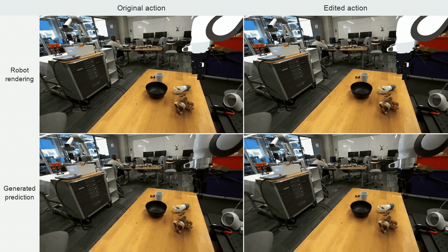](https://bjkim95.github.io/rofacto/static/videos/counterfactual/pick_tube.mp4)

**Watch the target change.** Top: original/edited robot renderings. Bottom: their generated predictions. Around 3–4 seconds, the two predictions lift different objects. This makes the dependence on the motion condition visible; it does not measure counterfactual accuracy. [Full video](https://bjkim95.github.io/rofacto/static/videos/counterfactual/pick_tube.mp4) · [Authors’ example](https://bjkim95.github.io/rofacto/#action-controllability)


In Equation 4, the vertical bar means “given”:

$$
p_\theta(V_{1:F}\mid B^{rgb}_{1:F},D^{scene}_{1:F},M^{rgb}_{1:F},D^{eef}_{1:F},T).
$$

Read this as: “the model's distribution of possible future videos, given the static scene RGB, scene depth, robot mesh RGB, end-effector depth, and scene description.” The distribution permits more than one generated future; the paper does not establish that their relative frequencies are calibrated physical probabilities.

For an illustrative cup-lifting task, the conditions show the initial cup and table, plus a rendered gripper approaching and closing. The output should show how the scene responds. The scene/action conditions do not reveal a recording of the cup's future motion. During training, that future recording supplies the noisy latent and supervised target described in Q17–18. At inference, the generator must produce the future without access to that recording. The text condition describes scene appearance and excludes the intended action and outcome. [RoFacto §§3.1, 3.5 and Appendix A](https://arxiv.org/abs/2607.22535v1)

This is an input relationship, not a claim that the network must obey each condition exactly. A conditioned generator can still ignore a prompt, hallucinate contact, or make a geometrically inconsistent prediction.

### 2. What is a “direct action interface”? (p. 2)

The model receives robot-specific numbers representing commands or states. For example, a sequence of `[x, y, z, roll, pitch, yaw, gripper]` vectors could describe the gripper's position, orientation, and opening. The network then has to associate those coordinates with visible motion in the camera image.

RoFacto inserts preprocessing between the commands and the video model:

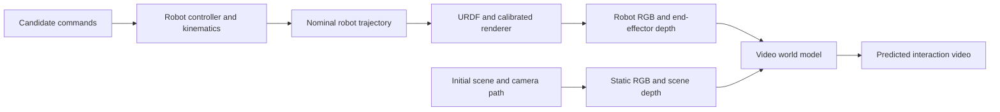

The controller computes the expected robot motion without scene interaction. The renderer shows that motion from the target camera. The learned model receives images that locate the robot in the scene's image coordinates. [RoFacto §§3.1–3.4](https://arxiv.org/abs/2607.22535v1)

Keep two distinctions separate: **numeric versus rendered** describes the representation; **raw, nominal, or logged** describes the source of the motion. A numeric condition can use deployment-available nominal states. A rendered condition can leak information if it uses future recorded states. RoFacto's Wan numeric baseline already receives nominal states.

### 3. Why would future robot states cause “leakage”? (p. 2)

They can reveal part of the outcome the model is supposed to predict. Imagine commanding a gripper to close around a cup. In a successful grasp, its recorded future opening may remain wider because the cup blocks the fingers. In a missed grasp, it may close completely. Supplying that future opening tells the predictor something about contact before it has predicted contact. This is an explanatory example, not a separate experiment in the paper.

[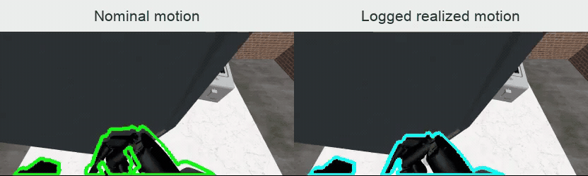](media/rofacto/contact-gap.mp4)

**Compare the outlines.** Green: nominal motion; cyan: logged realized motion. These are diagnostic overlays on the observed video, showing how the motion sources differ. The observed background is for comparison, not an extra future-video condition supplied to the model. [Full video](media/rofacto/contact-gap.mp4) · [Authors’ example](https://bjkim95.github.io/rofacto/#nominal-trajectory-conditioning)


The issue is **future-outcome information in the input**, rather than accidental mixing of the training and test sets. Current robot state is allowed. Future video is allowed as a training target. Future contact-affected robot state is privileged when the intended use is predicting the consequences of an unexecuted command.

Appendix C tests three arrangements: nominal prompts for both training and inference; logged prompts for both, an oracle setting; and logged training prompts followed by nominal inference prompts. On RoboCasa-GR1, their PSNR values are 25.70, 28.26, and 24.69 respectively. The oracle has an advantage, and matching training to the nominal deployment interface beats switching to it only at inference. These results support the mismatch concern; they do not establish accurate contact physics. [RoFacto §3.2 and Appendix C, Table 4](https://arxiv.org/abs/2607.22535v1)

There is a legitimate different task: “generate a video following this prescribed pose sequence.” Using a supplied pose sequence for that task is fine. VAP supports user-specified motion prompts. The leakage objection applies when an evaluation based on realized future motion is interpreted as prediction from commands that have not executed. [VAP §3](https://arxiv.org/html/2508.13104v1#S3)

### 4. Can you give an example of Visual Action Prompts? (p. 3)

VAP mainly conditions generation on videos of colored skeletons aligned with the camera view. Imagine a colored gripper skeleton approaching a cup and closing: the initial photograph supplies appearance, and the skeleton frames specify where the actor should move. The generator produces the corresponding scene video. The authors show the actual construction in their [pipeline figure](https://zju3dv.github.io/VAP/static/pipeline.png) and [project demonstrations](https://zju3dv.github.io/VAP/).

VAP also studies mesh RGB and depth prompts. For robot training data, it constructs prompts from logged robot states, with image-based filtering and optional per-frame homography correction. RoFacto therefore inherits the idea of presenting action as visible geometry. Its main distinction is computing the geometry from nominal motion available before scene interaction. A VAP-style visual representation does not inherently require privileged future states. [VAP §§3.1–3.3](https://arxiv.org/html/2508.13104v1#S3)

### 5. What are “hand mesh trajectories”? (p. 3)

A mesh represents the hand's surface using vertices connected into triangles. A trajectory supplies a sequence of poses for that surface: the wrist moves and rotates, while the fingers articulate. Rendering those posed meshes from a camera produces a hand-only video.

DWM gives that rendered hand video and a static-scene video to its generator. The hand condition contains the changing surface geometry, beyond a fingertip path or a single wrist position. For real videos, DWM recovers hands with HaMeR; its parameter baseline uses MANO hand pose, global orientation, and translation. [DWM method](https://snuvclab.github.io/dwm/), [DWM §4.3](https://arxiv.org/html/2512.17907v1#S4.SS3)

RoFacto applies a related interface to robot bodies. For its human-to-robot examples, the authors retarget human hand motion into robot motion **before** rendering the world model's condition. That ordering matters: the model sees the target robot geometry while predicting scene response. [RoFacto Appendix D](https://arxiv.org/abs/2607.22535v1)

[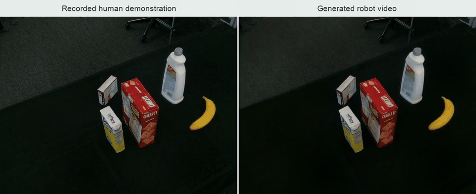](https://bjkim95.github.io/rofacto/static/videos/human2robot/detergent.mp4)

**Follow the transferred motion.** Left: a recorded DexYCB human demonstration. Right: generated robot video after retargeting. Watch the reaching and lifting sequence; the right panel is a prediction, not footage of a robot executing the demonstration. [Full video](https://bjkim95.github.io/rofacto/static/videos/human2robot/detergent.mp4) · [Authors’ example](https://bjkim95.github.io/rofacto/#application-human-demonstration--robot-video)


### 6. How do the M and B RGB streams differ, and what is D in DROID? (p. 3 and earlier questions)

They share camera coordinates but carry different information. The letters label streams; they do not name separate physical cameras.

| Symbol | Content | DROID construction |
|---|---|---|
| $M^{rgb}$ | Rendered robot mesh RGB over time | Render the Panda's nominal trajectory using robot geometry and camera calibration. |
| $B^{rgb}$ | Static scene appearance over time | Repeat the initial observed RGB frame across the prediction horizon. |
| $D^{eef}$ | End-effector-only depth over time | Render depth of the nominal gripper/end-effector geometry. |
| $D^{scene}$ | Initial scene depth in the same view | Estimate metric depth from ZED stereo observations using FoundationStereo. |

**D means depth.** It represents how far surfaces lie from the camera, rather than their color. The two depth streams let the generator compare the gripper's depth with the scene's depth where their image projections overlap.

“Static” refers to the underlying initial scene, not necessarily an unchanging picture. If the camera moves, the authors render that same scene from the changing viewpoints. In RoboCasa-GR1, they have the simulator's robot-free scene and camera trajectory, so they render both static RGB and depth along the path. For fixed-view DROID, the paper says it repeats the initial observation; it does not claim that every such image has had the initial robot removed. [RoFacto §§3.3–3.4 and Appendix A](https://arxiv.org/abs/2607.22535v1)

[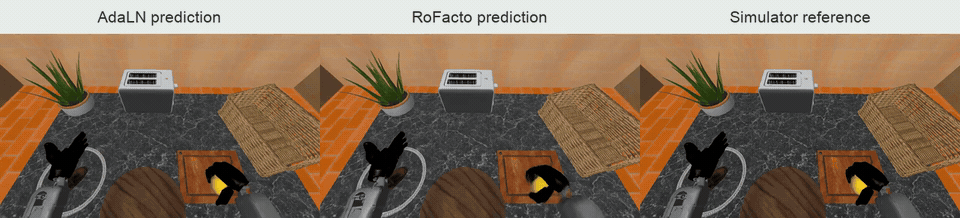](https://bjkim95.github.io/rofacto/static/videos/robocasa/rank051.mp4)

**Watch the camera move.** Left to right: AdaLN prediction, RoFacto prediction, simulator reference. This is an output comparison; the separate B/M/D inputs are not displayed. The moving viewpoint illustrates why those inputs must share camera coordinates. [Full video](https://bjkim95.github.io/rofacto/static/videos/robocasa/rank051.mp4) · [Authors’ example](https://bjkim95.github.io/rofacto/#results)


### 7. How many of the related papers have I heard of? (p. 2)

The repository establishes some prior mentions, though it cannot tell me everything you have read. Your September 1 review names **Ctrl-World, Cosmos, and DreamGen**, all cited here. It also discusses the **Dreamer and Genie families**, which does not establish that you read the particular cited versions. Hydra-0 is another familiar comparison from that review, although its August submission postdates RoFacto's July paper.

The dense first Related Work paragraph spans 26 distinct references. A useful reading map from RoFacto's bibliography is:

| Role | Papers |
|---|---|
| Earlier world models for planning/control | World Models, PlaNet, DreamerV3, DayDreamer, TD-MPC2 |
| Robot-specific numeric interfaces and policy learning | IRASim, Ctrl-World, WorldGym, World-Gymnast |
| Latent or abstract actions | DreamDojo, AdaWorld, CoWorld-VLA, CLAM, UniVLA, Learning Latent Action World Models in the Wild |
| Wider video/world-model context | Navigation World Models, Cosmos, DreamGen, Genie, DIAMOND, GameNGen, UniSim, iVideoGPT, Aether, Stable Virtual Camera/SEVA, GAIA-2 |

For assessing this paper's contribution, I would prioritize VAP, DWM, and the numeric-conditioning comparisons over reading that entire list. One naming trap: the action-chunking draft mentions **DexWM, arXiv:2512.13644**; RoFacto cites **Dexterous World Models/DWM, arXiv:2512.17907**. Those are different papers. [RoFacto §2 and bibliography](https://arxiv.org/abs/2607.22535v1)

## Nominal motion, simulation, and teleoperation

### 8. What separates raw-action mesh from nominal-trajectory rendering? Is the latter an Isaac Sim trajectory? (pp. 4, 7)

Both ablation rows render robot meshes. The difference is the sequence of robot states sent to the renderer.

**Raw-action mesh:** take the DROID joint/gripper targets and render them as if the robot attained each target at that instant. A command can request motion faster than the real arm can track.

**Nominal mesh:** replay those targets through the robot's controller and actuation limits, then render the resulting robot-only motion. For DROID, the authors use a scene-free Isaac Lab environment to produce this trajectory. Isaac Lab is their implementation of the nominalization step, not part of the definition of a nominal trajectory. [RoFacto §4.3 and Appendix A](https://arxiv.org/abs/2607.22535v1)

[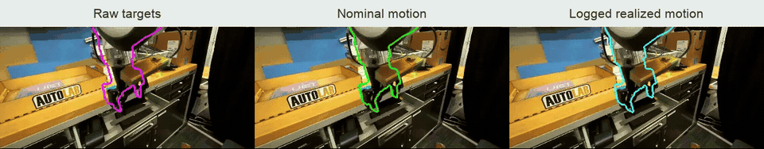](media/rofacto/nominal-motion.mp4)

**One episode, three motion sources.** Compare the magenta raw-target outline, green nominal outline, and cyan logged outline. These synchronized diagnostic overlays use the same observed background. They show motion alignment, not three generated world-model outputs; the future background is not a conditioning input. [Full video](media/rofacto/nominal-motion.mp4) · [Authors’ example](https://bjkim95.github.io/rofacto/#nominal-trajectory-conditioning)


An invented single-joint example makes the three signals distinct. Start at 0°. A command requests 90° after 0.1 seconds. Suppose a simplified controller permits only 60°/s, giving a nominal position of 6° at that time. In the real scene, contact might stop the joint at 4°. The raw target is 90°, the nominal state is 6°, and the realized state is 4°. These numbers illustrate the distinction; they are not measured Panda behavior.

Your action-realization-gap highlight corresponds to 90° versus 6° in that example. The nominal-to-realized gap corresponds to 6° versus 4°. RoFacto uses the robot-local stack to address the former and leaves the scene-dependent departure for the learned model. Nominal motion remains an approximation: its usefulness depends on the replay controller resembling the deployed controller.

### 9. Does “from deployment-available motion” mean “in comparison to” or “sourced from”? (p. 7)

**Sourced from.** The authors construct the rendered geometry from nominal motion that they can compute before executing the proposed action in the scene. Their comparison is separately with the raw-action mesh baseline.

A clearer paraphrase is: “The controller converts the proposed commands into nominal robot motion. We can compute this motion before deployment execution. Rendering it gives a prompt that better matches the robot's expected motion than rendering the raw targets.”

The paper infers better alignment from improved video reconstruction. Table 2 does not report a separate trajectory-alignment error. “Deployment-available” also does not mean the actual future contact-affected trajectory is already known. [RoFacto §4.3 and Appendix C](https://arxiv.org/abs/2607.22535v1)

### 10. Is a “shadow rollout” different from a no-scene simulation? (p. 5)

They implement the same conceptual step here: run a copy of the robot's proposed motion without allowing scene interaction to determine its future state. The names describe the two dataset-specific setups, rather than two competing prediction methods.

For DROID, the authors replay joint/gripper targets in a scene-free, robot-only **Isaac Lab** environment. For RoboCasa-GR1, they replay a **29D controller action** sequence from the clip-start state in a collision-free shadow rollout. The resulting GR1 state has **39 dimensions**, because the controller expands the hand commands into a larger articulated state. Both yield the nominal state trajectory that RoFacto renders. [RoFacto §4.1 and Appendix A](https://arxiv.org/abs/2607.22535v1)

“Shadow” means a separate replay alongside the observed rollout; it has nothing to do with rendering cast shadows. The paper does not publish enough controller settings or collision-configuration details to equate the implementations line by line. Neither nominal rollout has already simulated the cup's actual response for the world model.

### 11. Do Isaac Lab and the shadow rollout provide the mesh, depth, and RGB? (p. 5)

There are three jobs to distinguish. The **asset** supplies mesh geometry and robot structure. The **controller/simulation** supplies the sequence of robot states. The **renderer**, given those states and a calibrated camera, produces robot RGB and end-effector depth. The rollout moves an existing mesh; it does not discover or generate the robot's mesh from the commands. [RoFacto §§3.1–3.4](https://arxiv.org/abs/2607.22535v1)

Isaac Lab does support camera RGB and depth outputs when configured to render them. Its documentation distinguishes distance to the camera's optical center from depth along the camera's z-axis, so an implementation must keep its depth convention consistent. That capability does not mean all RoFacto inputs come from Isaac Lab. [Isaac Lab camera documentation](https://isaac-sim.github.io/IsaacLab/main/source/overview/core-concepts/sensors/camera.html)

In particular, DROID's static RGB comes from the real initial image, and its scene depth comes from stereo estimation. The authors do not need an Isaac reconstruction of the entire real kitchen to create those fixed-view conditions. RoboCasa provides a synthetic scene, so its renderer can supply static RGB and depth along a moving camera trajectory. [RoFacto Appendix A](https://arxiv.org/abs/2607.22535v1)

### 12. Could free teleoperation with a depth camera remove the need for a SpaceMouse? (p. 5 idea)

**It could, with a separate interface for expressing the operator's intended motion.** Depth can help locate a target in 3D; a depth display by itself does not specify a continuous six-degree-of-freedom command, finger motion, or when the operator wants to engage control.

For an illustrative point-selection interface, a clicked image pixel $(u,v)$ with calibrated z-depth $z$ gives the camera-space point

$$
p_c=zK^{-1}[u,v,1]^T,
$$

where $K$ contains the camera intrinsics. Transform that point into robot coordinates and you have a position target. You still need to specify orientation and gripper state, and handle targets in free space where there is no surface depth to click. This is a proposed interface design, not a RoFacto result.

If you mean tracking your own hand in front of a camera, **AnyTeleop is the closer precedent**: it uses vision-based human hand motion to control different robot arms and hands across simulation and hardware. RoFacto cites it for retargeting, but does not evaluate replacing a SpaceMouse. [AnyTeleop paper](https://arxiv.org/abs/2307.04577), [RoFacto Appendix D](https://arxiv.org/abs/2607.22535v1)

I would separate two experiments. First, keep the SpaceMouse and add depth or a ghost-gripper overlay to test whether operators make fewer depth-placement mistakes. Second, replace the input device with hand tracking and retargeting, then measure completion time, placement error, tracking loss, and task success. The first tests better visual feedback; the second tests a different control interface. RoFacto's depth ablation motivates the geometric question but supplies evidence about video prediction, not human teleoperation performance.

## The generative model

### 13. Does “latent” mean the model generates compressed frames? (p. 5 note)

Yes, with one extension: Wan compresses **time as well as image space**. A learned video autoencoder maps pixels into a smaller tensor. The generative network works on that tensor, and the decoder maps the final latent back into RGB frames. A latent is still a numerical representation with spatial and temporal structure, rather than a prose description of the scene. [Latent diffusion paper](https://arxiv.org/abs/2112.10752), [Wan architecture](https://arxiv.org/abs/2503.20314)

For RoFacto's 81-frame, 480×832 Wan clips, Wan's compression gives 21 temporal positions at 60×104 with 16 latent channels: $1+(81-1)/4=21$, $480/8=60$, and $832/8=104$. This is arithmetic from the documented compression ratios, not a measured speedup. [Wan §§4.1, 5.1.1](https://arxiv.org/html/2503.20314v1#S5.SS1.SSS1), [RoFacto Appendix B](https://arxiv.org/abs/2607.22535v1)

The VAE also encodes the conditioning streams. They remain separate inputs from the noisy future-video latent that the generator must refine.

### 14. What is the “residual dynamics formulation”? (p. 5)

The authors provide a rendering of the initial scene, then ask the model to account for the changes caused by interaction. DWM expresses the idea as

$$
V_{1:F}=\Pi(S_0;C_{1:F})+\Delta V_{1:F}.
$$

The first term shows the initial scene along the camera path. The residual $\Delta V$ represents how the interaction video differs from that static rendering. [DWM §3.2](https://arxiv.org/html/2512.17907v1#S3.SS2)

For a cup lift, the changes include the cup appearing higher, disappearing from its former location, and exposing the table behind it. If the camera moves, the static rendering already supplies the viewpoint change. The learned response must account for the interaction beyond that view change. This example explains the decomposition.

In RoFacto, **residual dynamics describes the intended modeling division and conditioning bias**. The objective trains a generator of the complete future-video latent through the latent-velocity prediction described in Q18. The paper does not specify a separate pixel-difference output that gets hard-added to the original RGB image, nor does it guarantee untouched background pixels. DWM's released training code likewise uses the complete target video for generative supervision, rather than a separate pixel-difference target. [RoFacto §3.5 and Appendix B](https://arxiv.org/abs/2607.22535v1), [DWM training code](https://github.com/snuvclab/dwm/blob/f62f309f024a3982a7e0a06d5b526c2caa659d37/training/cogvideox/train_dwm_cogvideox.py#L797-L816)

### 15. What is a “video inpainting backbone”? (p. 5)

Inpainting means generating designated missing or editable visual content using the available context. In video, those regions can extend across space and time. A backbone is the pretrained core model that the authors adapt to their task.

RoFacto uses **Wan2.1-Fun-V1.1-14B-InP**. Its inpainting conditioning path accepts the static scene video. The authors add latent channels for the rendered robot and depth streams, extend the input patch projection, and train that projection together with rank-64 LoRA adapters while freezing the remaining pretrained weights. [RoFacto Appendix B](https://arxiv.org/abs/2607.22535v1), [Official backbone model card](https://huggingface.co/alibaba-pai/Wan2.1-Fun-V1.1-14B-InP)

The motivation is to start with a model accustomed to generating video while using supplied visual context. DWM established this initialization strategy for interaction prediction. RoFacto adapts it to robot nominal-motion conditions; it does not train a video generator from scratch.

### 16. “Full mask” over what, spatially? Why can anything move if everything is known? (p. 5)

**The mask marks the entire static-context video as known: every image location throughout the prediction horizon.** It does not mask only the gripper, identify a contact region, or provide the actual future interaction video. Appendix B resolves the ambiguity by defining $m=1$ as all-known pixels. [RoFacto Appendix B](https://arxiv.org/abs/2607.22535v1)

The upstream implementation uses two conventions at different boundaries. VideoX-Fun's external edit mask uses 255 for hidden input. The pipeline removes those locations, then inverts the normalized mask before passing it to the transformer. Consequently, an all-zero external edit mask preserves the whole static input and produces all-one internal known-mask channels. DWM's released inference/training code corroborates the all-zero-external/all-one-internal arrangement. [VideoX-Fun mask construction](https://github.com/aigc-apps/VideoX-Fun/blob/968f0e2192ba4c7a12868bf36d73260d135424ca/videox_fun/pipeline/pipeline_wan_fun_inpaint.py#L604-L639), [DWM inference](https://github.com/snuvclab/dwm/blob/f62f309f024a3982a7e0a06d5b526c2caa659d37/training/cogvideox/inference.py#L359-L374)

The static context conditions a **separate generated output**. In the checked Wan pipeline, the sampler updates noisy output latents; it does not copy all known input pixels back into the output after each update. Fine-tuning can therefore teach the generator to move the cup while using the static image to retain scene appearance. “Known” does not impose an immutable output-pixel constraint. [VideoX-Fun sampling loop](https://github.com/aigc-apps/VideoX-Fun/blob/968f0e2192ba4c7a12868bf36d73260d135424ca/videox_fun/pipeline/pipeline_wan_fun_inpaint.py#L658-L724)

This verifies the named upstream framework and DWM, with RoFacto's appendix as evidence for its mask choice. RoFacto's own adapted implementation was not available to inspect.

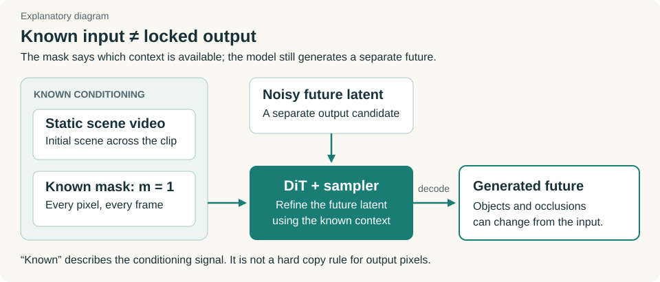

*Explanatory diagram for Q16. The known-mask signal belongs to the context path; it does not lock the output pixels.*


### 17. Why are the video latents noisy? What does that make the model invariant to? (p. 5)

Noise supplies a starting distribution from which the model can generate an unknown future. During training, the authors encode the known target video as $z_0$, sample Gaussian noise $\epsilon$, and form intermediate examples:

$$
z_\sigma=(1-\sigma)z_0+\sigma\epsilon.
$$

At $\sigma=0$, this is the clean target latent. At $\sigma=1$, it is noise. Training across intermediate values teaches the network how to update a noisy candidate while using the scene and action conditions. At inference, the future target is unavailable, so generation starts from noise and follows the learned updates toward a video. [RoFacto §3.5](https://arxiv.org/abs/2607.22535v1), [Flow Matching §§2–3](https://arxiv.org/html/2210.02747v2#S2)

The paper does **not** present this as a mechanism for invariance to camera position, lighting, embodiment, or action. The network needs to respond to the current noisy sample and its noise level. Different starting samples permit different outputs; that alone does not make the outputs a calibrated distribution of grasp success or failure.

There are two time axes: physical time across the video frames, and denoising time $\sigma$. A denoising step refines the clip's latent representation. It does not mean the robot takes one physical step or the model appends exactly one frame.

### 18. Is “velocity” a training hyperparameter? (p. 5)

**No. It is the supervised target for the network's latent-space update prediction.** Differentiate the interpolation with respect to denoising time:

$$
u=\frac{d z_\sigma}{d\sigma}=\epsilon-z_0.
$$

The training procedure computes $u$ from the clean latent and sampled noise. The network predicts a tensor $v_\theta(z_\sigma,\sigma\mid c,T)$, and the loss measures its error against $u$. Learning rate and LoRA rank are hyperparameters; this target velocity is neither one of those nor the robot's physical velocity. The upstream training code implements `target = noise - latents`. [RoFacto §3.5](https://arxiv.org/abs/2607.22535v1), [VideoX-Fun training implementation](https://github.com/aigc-apps/VideoX-Fun/blob/968f0e2192ba4c7a12868bf36d73260d135424ca/scripts/wan2.1_fun/train_lora.py#L1748-L1785)

For a scalar illustration, let the clean coordinate be 2 and the noise coordinate be −1. At $\sigma=0.5$, the mixture is 0.5 and the target velocity is −3. Generation moves toward smaller $\sigma$. A schematic Euler step to $\sigma=0.4$ gives $0.5+(-0.1)(-3)=0.8$, closer to 2. The real sampler uses the learned prediction because it does not know the clean future latent.

The target is constant along that particular straight interpolation, but the learned vector field varies across noisy samples and noise levels. It combines supervision from many data/noise pairs. The direction convention matters: RoFacto defines increasing $\sigma$ as data-to-noise, so inference traverses it in reverse. [Flow Matching objective](https://arxiv.org/html/2210.02747v2#S4)


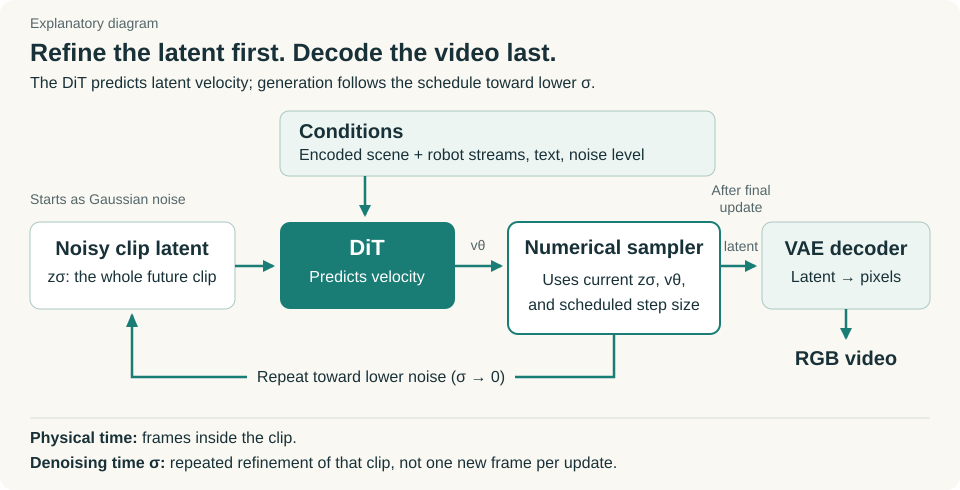

*Explanatory diagram for Q17–19. Each solver step refines the clip latent; physical video time runs across the frames inside that latent.*

### 19. What is a DiT block, and what follows it in the architecture diagram? (p. 4 and earlier question)

The architecture diagram is Figure 1 in the original paper; Figure 2 illustrates the realization gaps.

[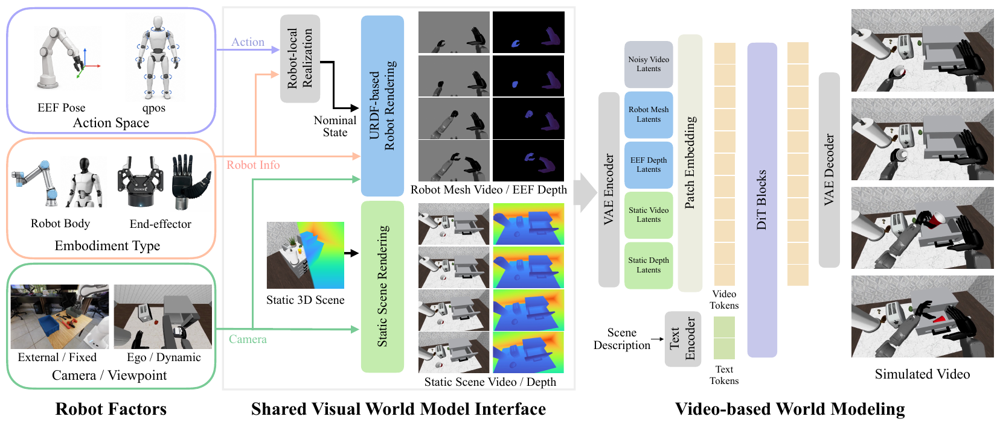](https://bjkim95.github.io/rofacto/static/image/overview.png)

*Authors’ Figure 1. Trace the blue robot streams and green scene streams into the model. The compact figure omits the explicit solver loop, shown in the explanatory diagram above.* [Original figure](https://bjkim95.github.io/rofacto/static/image/overview.png)

 A **diffusion transformer block** processes tokens made from patches of the video latent. Attention lets tokens exchange information; feed-forward layers transform their features. Conditioning gives this processing access to the scene, motion, text, and noise level. Multiple blocks form the denoising/vector-field predictor. [DiT §3](https://arxiv.org/html/2212.09748v2#S3)

The complete generation path has an intermediate step that a compact figure can hide:

```text
Noisy future latent + encoded conditions
  → patch embedding → stack of DiT blocks
  → output projection / unpatchify → velocity prediction
  → numerical sampler updates the noisy future latent
  → repeat the network/sampler cycle
  → final latent → VAE decoder → RGB video
```

So the DiT's immediate output is used to update the latent; the VAE decodes after sampling finishes. It does not decode a finished video after each individual transformer block. [Wan architecture](https://arxiv.org/html/2503.20314v1#S4.SS2.SSS1), [Upstream sampling loop](https://github.com/aigc-apps/VideoX-Fun/blob/968f0e2192ba4c7a12868bf36d73260d135424ca/videox_fun/pipeline/pipeline_wan_fun_inpaint.py#L686-L724)

RoFacto's main configuration supplies 84 input channels: 16 noisy-video channels, 16 static-video channels, four mask channels, and 16 each for robot RGB, end-effector depth, and scene depth. The output still predicts the future-video latent update; it is not an 84-channel reconstruction of every input stream. [RoFacto Appendix B](https://arxiv.org/abs/2607.22535v1)

### 20. Is SVD in contrast to DiT? (p. 5)

They name different levels of the system.

| Term | What it identifies |
|---|---|
| Latent video diffusion/flow | Generating video in a compressed learned representation. |
| Stable Video Diffusion, SVD | A particular pretrained model family whose predictor uses a U-Net with temporal convolution and attention. |
| Diffusion Transformer, DiT | An architecture for the predictor, using transformer blocks over latent patches. |
| Wan2.1-Fun InP | The specific backbone family used for RoFacto's main DiT-based model. |

An architecture comparison would be **U-Net versus transformer**. SVD and Wan both operate on latents, so latent generation does not distinguish them. RoFacto tests its rendered interface with both backbones, but changes resolution and training setup across backbone groups. Their raw scores cannot isolate the effect of U-Net versus DiT. [SVD paper](https://arxiv.org/abs/2311.15127), [DiT paper](https://arxiv.org/abs/2212.09748), [RoFacto Table 1 and Appendix B](https://arxiv.org/abs/2607.22535v1)

## Experiments and evidence

### 21. Who built DiT4DiT, and why is it here? (p. 5)

**Teli Ma, Jia Zheng, Zifan Wang, Chunli Jiang, Andy Cui, Junwei Liang, and Shuo Yang**, affiliated with **Mondo Robotics, HKUST(GZ), and HKUST**. DiT4DiT connects a video diffusion transformer to an action diffusion transformer, using video-model features to help predict robot actions. [Official project](https://dit4dit.github.io/), [DiT4DiT paper](https://arxiv.org/abs/2603.10448)

RoFacto uses this separate VLA policy to collect RoboCasa-GR1 trajectories: 24 tasks with 50 episodes per task. Its authors then construct clips and nominal robot motion from those rollouts. DiT4DiT is the action-producing policy in that data pipeline; Wan is the main scene-response generator being trained. [RoFacto §4.1 and Appendix A](https://arxiv.org/abs/2607.22535v1)

The DiT4DiT authors have released training, evaluation, and deployment code, including checkpoint links. That release does not constitute a RoFacto release. [Official DiT4DiT repository, checked September 10](https://github.com/Mondo-Robotics/DiT4DiT)

### 22. What does “qualitative study” mean here? (p. 5)

The authors inspect and present example videos to show what the method does, rather than reporting an aggregate score for those cases. The HRDexDB examples show transfer to an xArm 6–Inspire F1 arm/hand combination. The DexYCB examples show robot video generation from retargeted human motion. [RoFacto §§4.4–4.5 and Appendix D](https://arxiv.org/abs/2607.22535v1)

[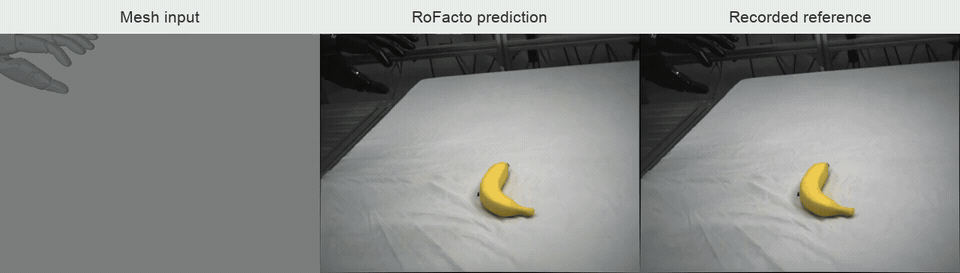](https://bjkim95.github.io/rofacto/static/videos/embodiment/hrdex_banana.mp4)

**An example of qualitative evidence.** Left to right: xArm 6–Inspire F1 mesh input, generated video, recorded reference. Watch the fingers and banana during the lift. The model also receives depth, which this strip omits. One example does not establish a transfer success rate. [Full video](https://bjkim95.github.io/rofacto/static/videos/embodiment/hrdex_banana.mp4) · [Authors’ example](https://bjkim95.github.io/rofacto/#zero-shot-embodiment-generalization)


A video in which the robot approaches an object and the object moves supplies an example of the model's behavior. It does not tell us how often that behavior is correct across a representative set. The paper reports neither a task-success percentage nor a formal human-rating protocol for these transfer studies. “Qualitative” does not mean useless; it identifies the kind of evidence available and limits the generalization we can draw from it.

### 23. What are reconstruction metrics? PSNR, SSIM, LPIPS: what do these numbers mean? (p. 6)

They compare the generated video with the recorded reference clip. Here, “reconstruction” means reproducing held-out observations, rather than the separate question of how well the VAE compresses and reconstructs its own input. RoFacto reports metrics per clip and averages them over its evaluation set. [RoFacto §4.2](https://arxiv.org/abs/2607.22535v1)

| Metric | What it measures | Better direction |
|---|---|---|
| **PSNR**, peak signal-to-noise ratio | Pixel error relative to the available pixel-value range, expressed in decibels. | Higher ↑ |
| **SSIM**, structural similarity index | Similarity of local luminance, contrast, and structure. | Higher ↑ |
| **LPIPS**, learned perceptual image patch similarity | Distance between learned visual features of the two images. | Lower ↓ |

PSNR derives from mean squared pixel error:

$$
\mathrm{MSE}=\operatorname{mean}((\hat I-I)^2),\qquad
\mathrm{PSNR}=10\log_{10}(L^2/\mathrm{MSE}),
$$

where $L$ is the pixel range, such as 255 for an 8-bit representation. Lower error produces higher PSNR. A 3 dB increase corresponds to roughly halving MSE for the same individual comparison and range; averaging PSNR across clips complicates translating a table-wide difference into aggregate MSE. [Documented PSNR implementation](https://github.com/Lightning-AI/torchmetrics/blob/master/src/torchmetrics/image/psnr.py)

SSIM compares local image statistics; identical images score 1, but the score is not a percentage of physically correct events. LPIPS compares features from a visual network with learned calibration; identical inputs produce zero distance and lower is more similar. It was developed around perceptual judgments, not robot-contact labels. [Original SSIM paper](https://ece.uwaterloo.ca/~z70wang/publications/ssim.pdf), [LPIPS paper](https://arxiv.org/abs/1801.03924), [Authors' LPIPS implementation](https://github.com/richzhang/PerceptualSimilarity)

Thus 0.859 SSIM does not mean 85.9% grasp success, and 0.178 LPIPS does not mean 17.8% physical error. The paper also leaves some reproducibility details unspecified, including the LPIPS backbone, exact SSIM settings, and resize filter. None of the sources above establishes that RoFacto used that particular software implementation.

### 24. Why would lower resolution “inflate” reconstruction metrics? (p. 6)

Shrinking both images can erase the detail where they disagree. Consider an illustrative two-pixel patch:

| | Reference | Prediction | MSE |
|---|---|---|---:|
| Original | `[100, 100]` | `[90, 110]` | 100 |
| Average each down to one pixel | `[100]` | `[100]` | 0 |

The higher-resolution prediction was imperfect. Averaging concealed its errors. For equal-sized block averaging, the squared average error cannot exceed the average squared error, so this operation can reduce MSE and raise PSNR. **The explanation is error averaging, not just having fewer pixels:** MSE already divides by the pixel count. A constant +10 error would survive this downsampling.

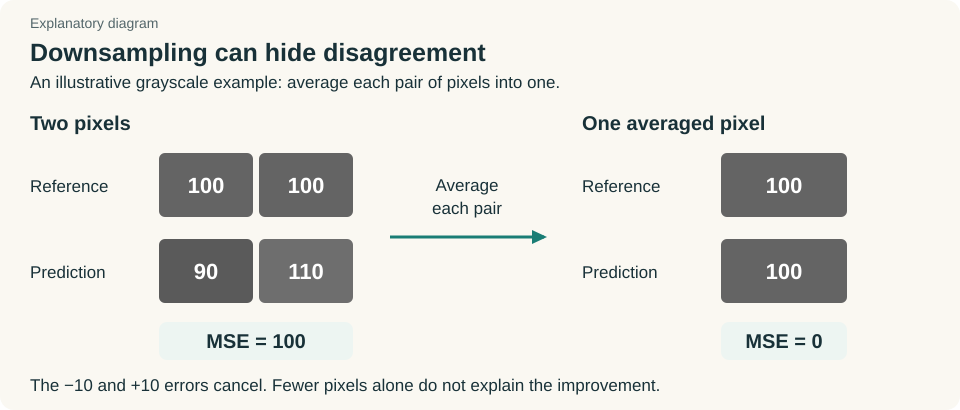

*The same invented example shown visually. Averaging hides the discrepancy; it does not improve the original prediction.*


“Inflate” is loose wording. The intended meaning is that a coarser comparison can make the match look better. LPIPS improves by going down; the claim cannot mean that all metric values rise. The outcome for SSIM and LPIPS depends on the images, scale, and implementation. The SSIM authors themselves discuss choosing an evaluation scale. [SSIM suggested usage](https://ece.uwaterloo.ca/~z70wang/research/ssim/)

RoFacto evaluates SVD at **192×320** and Wan at **480×832**, with different training data as well. It does not report a controlled experiment evaluating identical predictions at both resolutions. Therefore SVD's 25.05 PSNR versus Wan's 21.87 does not show that SVD is the better world model or quantify a resolution effect. Compare methods within each backbone group. [RoFacto §4.2, Table 1 and Appendix B](https://arxiv.org/abs/2607.22535v1)

### 25. Pose conditioning versus rendered conditioning? What is a numeric state vector? (p. 6)

A **state vector** is an ordered list of numbers describing the robot at one time. Pose conditioning supplies positions and orientations in such a vector. Rendering uses robot geometry, state, and camera calibration to show the corresponding visible body.

The numeric condition might specify where the gripper is in a robot coordinate frame. The rendered condition places its fingers and arm links in the same image coordinates as the cup. The network then receives the consequences of forward kinematics and camera projection instead of having to recover those mappings from the vector alone.

RoFacto's Wan **AdaLN baseline** uses these particular nominal-state vectors:

| Dataset | Numeric condition |
|---|---|
| DROID | Seven values: six-dimensional end-effector pose `[x,y,z,roll,pitch,yaw]`, plus gripper scalar `g`. These are **not seven arm joint angles**. |
| RoboCasa-GR1 | 39 values: 7 per arm, 11 per hand, and 3 for the waist. |
| Joint-training representation | A zero-padded 46D union of the two state formats; four frame states give 184 input values per Wan latent frame. |

AdaLN means **adaptive layer normalization**: a conditioning network changes feature scales/shifts inside the transformer according to the input state. The paper specifies this mechanism but does not release its complete per-layer implementation. The SVD comparison uses a Ctrl-World-style pose interface; the original Ctrl-World encodes pose vectors and injects them through frame-wise attention. [RoFacto Appendix B](https://arxiv.org/abs/2607.22535v1), [DiT architecture](https://arxiv.org/abs/2212.09748), [Ctrl-World method](https://arxiv.org/html/2510.10125v3)

A limitation of the comparison follows from these details. The DROID EEF vector omits parts of the full arm configuration and shape supplied by a URDF rendering. The full Wan rendered condition also supplies scene and EEF depth. Holding the backbone fixed does not make the available information or conditioning adapters identical. The experiment tests the usefulness of the complete interface, with its geometry and depth; it does not isolate a pure “pixels versus numbers” transformation of identical information.

[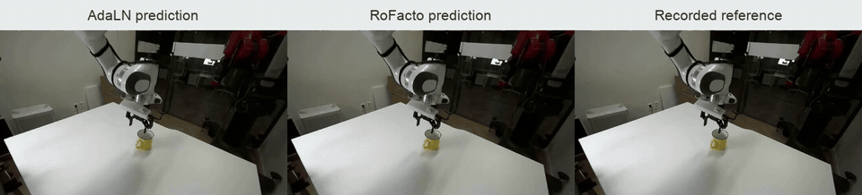](https://bjkim95.github.io/rofacto/static/videos/droid/rank041.mp4)

**Compare the lift of the yellow object.** Left to right: AdaLN prediction, RoFacto prediction, recorded reference. Inspect robot placement and object motion through the clip, especially near the end. These are selected examples; Q27 gives the aggregate measurements. [Full video](https://bjkim95.github.io/rofacto/static/videos/droid/rank041.mp4) · [Authors’ example](https://bjkim95.github.io/rofacto/#results)


### 26. What is “occlusion ordering,” and why aren't these metrics enough? (p. 6)

Occlusion ordering means **which surface sits in front of another from the camera's viewpoint**. If the gripper passes behind a cup, the cup should hide the overlapping part of the gripper. Drawing the fingers on top would get the ordering wrong. This describes front/back depth, not the temporal order of frames.

Two objects can overlap in a 2D image while remaining far apart in 3D. At a shared projected pixel, an illustrative gripper depth of 0.8 m and cup-surface depth of 1.0 m place the gripper in front. Reversing those depths places it behind. Similar depths make contact more plausible, but do not prove contact: surface geometry, motion, and uncertainty still matter. RoFacto supplies both depth streams to help the network reason about this ambiguity; it does not install a hard contact solver through that comparison. [RoFacto §3.4 and Figure 4](https://arxiv.org/abs/2607.22535v1)

[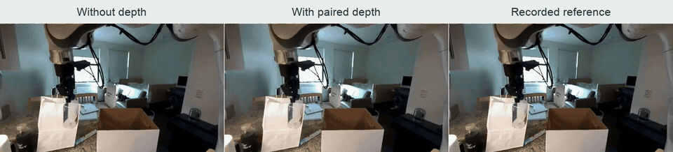](https://bjkim95.github.io/rofacto/static/videos/depth/depth_c02_full.mp4)

**Watch the white paper bag.** Left: without depth; middle: with paired depth; right: reference. Around 1–2.5 seconds, the no-depth prediction moves the bag with the gripper/bottle, while the depth-conditioned prediction and reference leave it approximately stationary. This is the authors’ selected false-contact example. [Full video](https://bjkim95.github.io/rofacto/static/videos/depth/depth_c02_full.mp4) · [Authors’ example](https://bjkim95.github.io/rofacto/#impact-of-depth-conditioning)


Whole-image metrics can penalize incorrect contact pixels, but a brief event involving a small object may contribute little to a clip average dominated by the static scene. A plausible alternative future can also differ from the single recorded reference. The score therefore does not directly answer whether the grasp missed, whether the object moved without contact, or whether the fingers passed through it. The paper explicitly identifies small motions, brief contact, and occlusion ordering as cases where these metrics are least diagnostic, and inspects those cases visually. [RoFacto §4.2](https://arxiv.org/abs/2607.22535v1)

### 27. Which results support the highlighted claims, and what remains untested?

The DROID-only ablation most directly separates the two changes highlighted in your notes:

| Table 2 condition | PSNR ↑ | SSIM ↑ | LPIPS ↓ |
|---|---:|---:|---:|
| Raw-action mesh RGB | 21.57 | 0.860 | 0.175 |
| Nominal mesh RGB | 22.44 | 0.872 | 0.164 |
| Nominal mesh + EEF/scene depth | 23.08 | 0.874 | 0.161 |

Replaying commands before rendering improves all three reported means. Adding the depth pair improves them again. The broader Table 1 comparisons show gains for the rendered interface within both backbone groups: SVD/DROID improves PSNR from 23.15 to 25.05; Wan/DROID from 18.57 to 21.87; Wan/GR1 from 17.67 to 24.61. The Wan comparisons use joint training, unlike Table 2. The paper evaluates 256 DROID and 128 GR1 held-out clips and supplies no repeated-training variability or confidence intervals for these tables. [RoFacto §4 and Tables 1–2](https://arxiv.org/abs/2607.22535v1)

The novelty assessment needs a narrower claim than “render actions” or “learn only scene changes.” VAP already supplies visual action prompts; DWM already combines static-scene rendering, hand-mesh motion, and inpainting-based interaction generation. Relative to those works, RoFacto's strongest contribution is the **nominal, pre-interaction robot interface**, used during both training and inference, together with **paired EEF/scene depth** and the supporting ablations. Depth prompting in general also predates RoFacto. [VAP](https://zju3dv.github.io/VAP/), [DWM](https://snuvclab.github.io/dwm/), [RoFacto §§3–4](https://arxiv.org/abs/2607.22535v1)

The paper demonstrates video prediction and qualitative motion/embodiment transfer.

[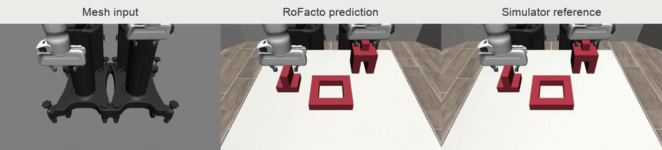](https://bjkim95.github.io/rofacto/static/videos/embodiment/dexmimicgen_dual.mp4)

**A new two-Panda composition.** Left to right: mesh input, generated video, simulator reference. The strip omits the depth conditions. This is qualitative evidence for this configuration; GR1 training already includes two arms, so the claim is not that the model has never seen bimanual motion. [Full video](https://bjkim95.github.io/rofacto/static/videos/embodiment/dexmimicgen_dual.mp4) · [Authors’ example](https://bjkim95.github.io/rofacto/#zero-shot-embodiment-generalization)

The paper does not report closed-loop policy improvement, prospective action-ranking accuracy, contact forces, or calibrated failure probabilities. The authors acknowledge dependence on robot assets/calibration, the difficulty of real moving-camera scene reconstruction, and success-heavy training data. Appendix B uses four Wan denoising steps with a distillation LoRA, but gives no wall-clock result establishing suitability for online planning. [RoFacto §5 and Appendices B, E](https://arxiv.org/abs/2607.22535v1)

As of September 10, the official [RoFacto repository](https://github.com/bjkim95/rofacto) says “Code coming soon”; no official checkpoint was located. DWM has [released code](https://github.com/snuvclab/dwm) and [CogVideoX](https://huggingface.co/byungjun-kim/DWM-CogVideoX-Fun-5b-LoRA) and [Wan](https://huggingface.co/byungjun-kim/DWM-Wan2.1-Fun-14b-LoRA) LoRA checkpoints. Those provide a precursor to study, not a reproduction of RoFacto's nominal controller replay and depth interface.

## Annotation coverage

| Scanned page | Questions and notes addressed |
|---|---|
| 1 | Policy improvement/ranking motivation and the distinction between motivation and demonstrated use: Q27 and the companion review. |
| 2 | Direct action interface Q2; leakage Q3; familiarity with related work Q7; contribution highlights Q27. |
| 3 | Conditioning Q1; VAP example Q4; hand mesh trajectories Q5; M/B/D notes Q6. |
| 4 | Action-realization versus nominal-realized gap Q8; DiT label and what follows it Q19. |
| 5 | Shadow rollout Q10; mesh/depth sources Q11; depth-camera teleop idea Q12; latent note Q13; residual dynamics Q14; inpainting Q15; mask Q16; noise/invariance Q17; velocity Q18; SVD versus DiT Q20; DiT4DiT authors Q21; qualitative study Q22. |
| 6 | Reconstruction metrics and acronyms Q23; resolution Q24; pose versus rendered and numeric conditioning Q25; occlusion ordering Q26. |
| 7 | Raw-action versus nominal rendering Q8; meaning of “from” Q9; ablation and alignment highlights Q27. |

The scans contain the original paper's pages 1–7. The research also uses the remaining original pages and appendix. Faint reverse-side show-through was not treated as a separate annotation.
